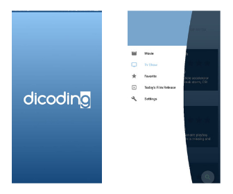
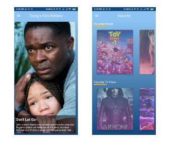
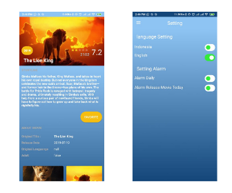

# FilmMadeKt
dicoding movie catalog

preview application

An application about movies and tv shows that utilizes the REST API from The Movie DB.

In-app features:

1. see tv shows based on Top Rated and Popular.

2. see movies based on Now Showing, Coming Soon, and Popular.

3. Add TV shows and movies to your Favorites.

4. Search for TV and Film Shows.

5. Displaying Movie that aired on this day.

6. Settings about application.

link for The Movie Db :
https://www.themoviedb.org/documentation/api?language=en-US

Thanks
------
* The **Android** and **Renaldy Sabdo** for the build this application.
* Everyone who has contributed code and reported issues!

Enjoy The Apps.
